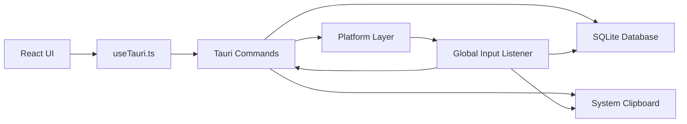

# QuickSend 架构说明

QuickSend 由前端界面、Tauri 命令层、Rust 系统能力和 SQLite 数据库组成。整体目标是把常用短语管理在本地，并通过全局输入监听快速写入剪贴板或目标应用。

## 模块视图



## 前端

前端使用 hash 路由区分两个界面：

- `#/popup`：快捷短语面板。
- `#/settings`：设置窗口。

`Popup.tsx` 负责快速搜索、键盘导航、分组切换、粘贴和复制。它会读取分组、设置和进程规则，根据当前前台进程决定默认分组。

`Settings.tsx` 负责完整的数据管理，包括短语、分组、文本扩展、进程规则、默认分组、开机自启动和 JSON 备份。

## 后端命令层

`commands/mod.rs` 暴露给前端的 Tauri 命令，主要分为：

- 分组 CRUD。
- 短语 CRUD。
- 粘贴和复制。
- 文本扩展 CRUD。
- 进程规则 CRUD。
- 前台进程和自启动。
- 设置读写。
- JSON 导入导出。

命令层保持薄封装，核心数据操作委托给数据库模块，平台相关能力委托给平台模块。

## 数据库

`db/mod.rs` 负责 SQLite 初始化、默认数据、CRUD 和导入导出。

启动时如果没有任何分组，会写入默认分组、示例短语和文本扩展规则。数据库保存在系统数据目录下的 `quicksend/quicksend.db`。

导出结构包含：

```json
{
  "version": 1,
  "groups": [],
  "phrases": [],
  "text_expansions": [],
  "process_rules": []
}
```

## 全局输入监听

`input.rs` 使用 `rdev` 监听全局键盘事件，处理三类行为：

- `Ctrl+Alt+Q`：呼出或隐藏快捷面板。
- 独立短语热键：匹配短语上的 `hotkey` 字段并直接粘贴。
- 文本扩展：记录最近输入字符，检测缩写后按 `Alt` 展开。

文本扩展的流程是：

1. 记录普通输入字符到缓冲区。
2. 用户按下并松开 `Alt`。
3. 查找启用状态下、能匹配缓冲区结尾的最长缩写。
4. 写入展开文本到剪贴板。
5. 模拟退格删除缩写。
6. 模拟系统粘贴快捷键。

## 粘贴流程

短语粘贴流程：

1. 根据短语 ID 从数据库读取短语。
2. 隐藏快捷面板。
3. 文本短语写入系统剪贴板。
4. 图片短语将 base64 图片解码后写入系统剪贴板。
5. 延迟约 80ms。
6. 模拟 `Ctrl+V`，macOS 上模拟 `Command+V`。

右键复制只执行写入剪贴板，不模拟粘贴。

## 平台能力

`platform/mod.rs` 封装平台差异：

- 鼠标位置：用于把快捷面板显示在鼠标附近。
- 前台进程：用于进程规则匹配。
- 开机自启动：Windows 写注册表和启动目录，macOS 写 LaunchAgent，Linux 写 autostart desktop 文件。

Linux 的鼠标位置和前台进程检测依赖 `xdotool`。

## 单实例

应用使用 `127.0.0.1:48273` 做单实例锁。第一个实例成功监听该端口；后续实例启动时会连接该端口并通知已有实例打开设置窗口，然后自身退出。

## 隐私与数据边界

QuickSend 默认只使用本地数据库和系统剪贴板，不上传用户短语。导入导出的 JSON 可能包含敏感文本或图片数据，提交 GitHub 前需要确认没有把备份文件或数据库一起提交。

