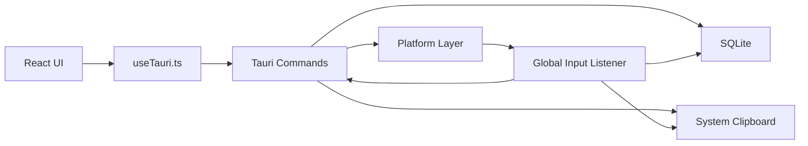

# QuickSend Architecture

QuickSend is a local-first desktop app made of a React UI, Tauri commands, Rust system integrations, and a SQLite database.

## Module Map

## Frontend

The app uses hash routes:

- `#/popup`: quick phrase popup
- `#/settings`: full management window

Important files:

- `Popup.tsx`: group tabs, search, keyboard navigation, paste/copy, template variable form
- `Settings.tsx`: phrase management, tags, favorites, filters, expansion settings, clipboard history, app rules, backup
- `useTauri.ts`: frontend wrappers for Tauri commands
- `pinyin.ts`: fuzzy and pinyin matching

## Rust Commands

`commands/mod.rs` exposes Tauri commands for:

- Groups
- Phrases
- Text expansion
- Process rules
- Settings
- Clipboard/paste operations
- Import/export
- Autostart and active process detection

## Database

`db/mod.rs` owns the SQLite schema, lightweight migrations, CRUD operations, and import/export.

Main tables:

- `groups`
- `phrases`
- `text_expansions`
- `process_rules`
- `settings`

Important phrase columns:

- `favorite`
- `usage_count`
- `last_used_at`
- `tags`
- `hotkey`
- `abbreviation`

## Input Listener

`input.rs` uses `rdev` to listen globally for keyboard events.

It handles:

- `Ctrl + Alt + Q` popup toggle
- phrase-specific hotkeys
- abbreviation expansion after Space

The listener checks the app blacklist before triggering phrase hotkeys or text expansion.

## Clipboard Flow

Text phrase paste:

1. Read phrase by ID.
2. Hide popup.
3. Write text to system clipboard.
4. Simulate paste shortcut.
5. Record usage.

Image phrase paste:

1. Decode stored image data.
2. Write image to system clipboard.
3. Simulate paste shortcut.
4. Record usage.

Clipboard history in the settings page is currently frontend-local via `localStorage`, with sensitive-looking text filtered before saving.

## Platform Layer

`platform/mod.rs` handles:

- cursor position
- foreground process name
- autostart

Platform-specific code should stay there instead of being mixed into command handlers.

## Single Instance

QuickSend binds `127.0.0.1:48273`. If another process starts while the first instance is running, it notifies the existing instance to open settings and then exits.

## Privacy

QuickSend stores user data locally. It does not upload phrases, clipboard history, images, settings, or backups.

Exported JSON and SQLite databases can contain sensitive content and should not be committed.
